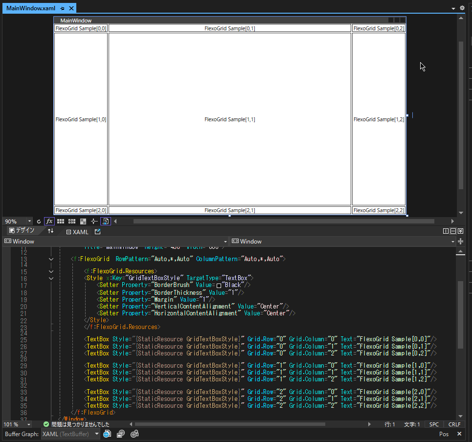

# FlexoGrid


*FlexoGrid は、簡潔な記述で WPF の Grid レイアウトを設定できる軽量なライブラリです。  
`RowPattern` と `ColumnPattern` を指定することで、従来の XAML より直感的にレイアウト構築が可能です。

FlexoGrid is a lightweight library for WPF that enables concise and intuitive grid layout configuration.  
By specifying `RowPattern` and `ColumnPattern`, you can build layouts more intuitively than with conventional XAML.

---

## 📦 プロジェクト構成  / Project Structure

```
/
├── FlexGridWPF/ # FlexoGrid ライブラリ (DLL) / FlexoGrid library
│ └── FlexoGrid.csproj
├── FlexoGridSample/ # サンプル WPF アプリ / Sample WPF application
│ └── FlexoGridSample.csproj
├── README.md # このファイル / This file
├── LICENCE # ライセンス / License file
```

---
## ✨ 特長 / Features

- `RowPattern`, `ColumnPattern` に `"Auto,*,Auto"` などの文字列でレイアウト指定が可能  
  Layouts can be defined using pattern strings like `"Auto,*,Auto"`
- `GridLength` の柔軟な解釈（`Auto`, `*`, 数値など）  
  Flexible interpretation of `GridLength` values such as `Auto`, `*`, and numeric values
- サンプル付きで導入が簡単  
  Easy to get started with included samples

## 🖼️ Screenshot

 

- 
## 🚀 使用方法 / Usage

### 1. XAML での使用例 / XAML Usage Example

```xml
<Window x:Class="SampleApp.MainWindow"
        xmlns="http://schemas.microsoft.com/winfx/2006/xaml/presentation"
        xmlns:f="clr-namespace:FlexGridWPF;assembly=FlexGridWPF"
        ... >

    <f:FlexoGrid RowPattern="Auto,*,Auto" ColumnPattern="Auto,*,Auto">
        <TextBlock Grid.Row="0" Grid.Column="0" Text="Top Left" />
        <TextBlock Grid.Row="1" Grid.Column="1" Text="Center" />
        <TextBlock Grid.Row="2" Grid.Column="2" Text="Bottom Right" />
    </f:FlexoGrid>
</Window>
```

### 2. RowPattern / ColumnPattern の形式 / Format of RowPattern / ColumnPattern

Auto または A: コンテンツサイズに合わせる
Auto or A: Auto-size to content

* や 2*: スターサイズ（比率）
* or 2*: Star sizing (relative ratio)

数値: ピクセル固定値
Numeric: Fixed pixel value

例："Auto,*,2*,100" → 4行構成
Example: "Auto,*,2*,100" → Defines 4 rows

---

## 🛠️ ビルド方法  / Build Instructions

Visual Studio または `dotnet` CLI でビルド可能です。
You can build the project using Visual Studio or the dotnet CLI.

```bash
dotnet build FlexGridWPF/FlexoGrid.csproj
dotnet run --project FlexoGridSample/FlexoGridSample.csproj
```

---

## 📄 ライセンス / License

このプロジェクトは [MIT License](https://opensource.org/licenses/MIT) の下で公開されています。自由に利用・改変・配布が可能です。

This project is licensed under the MIT License.
You are free to use, modify, and distribute it.

---

## 🙏 クレジット / Credits

本ライブラリは参考実装に基づき、独自に再設計・再構成されたものです。

This library was independently redesigned and restructured based on reference implementations.